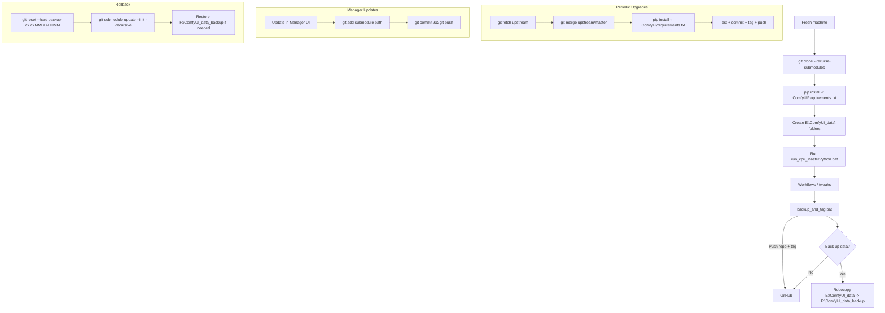

# ComfyUI (Fork) — Customised, Git-Tracked, External Data Layout

This repository is my **customised ComfyUI** setup on Windows with:
- **System Python** (no embedded Python) for full control.
- **ComfyUI Manager** installed as a **Git submodule** under `ComfyUI/custom_nodes/comfyui-manager` so it can self-update.
- **Large/volatile data** stored **outside** the repo in `E:\ComfyUI_data` (models, outputs, user, extra nodes).
- A **launcher BAT** named `run_cpu_MasterPython.bat` that runs ComfyUI via `.\ComfyUI\main.py` and redirects outputs.

> Repo root on this machine: `E:\ComfyUI_windows_portable`  
> System Python: `C:\Users\justi\AppData\Local\Programs\Python\Python310\python.exe`  
> External data root: `E:\ComfyUI_data`

---

## 1) Prereqs (one-time)
- Install **Git for Windows** and **Python 3.10+**.
- Install a matching **PyTorch** (GPU/CPU) for your setup (see PyTorch install page), then:
  ```bat
  pip install -r ComfyUI/requirements.txt
  ```

---

## 2) External data layout (NOT in Git)
All heavy data lives in `E:\ComfyUI_data`:

```
E:\ComfyUI_data\
├─ models\
│  ├─ checkpoints\
│  ├─ vae\
│  ├─ loras\
│  ├─ controlnet\
│  ├─ embeddings\
│  └─ upscale_models\
├─ outputs\
│  └─ temp\
├─ user\                  # profiles, saved workflows, configs
└─ custom_nodes_extra\    # optional extra custom nodes (not tracked in Git)
```

---

## 3) Repo layout (Git-tracked)
```
E:\ComfyUI_windows_portable\
├─ ComfyUI\               # core ComfyUI sources
│  ├─ main.py
│  └─ custom_nodes\
│     └─ comfyui-manager\   # ComfyUI Manager (Git submodule)
├─ extra_model_paths.yaml   # maps external model/node dirs
├─ run_cpu_MasterPython.bat # launcher (uses .\ComfyUI\main.py)
├─ backup_and_tag.bat       # one-click repo+data backup (this repo)
├─ logs\                    # created at runtime by launcher
└─ .gitignore, README.md, .gitmodules, etc.
```

> **Note:** We deliberately use `.\ComfyUI\main.py` (not a root `main.py`).

---

## 4) extra_model_paths.yaml
This file makes ComfyUI look in `E:\ComfyUI_data` for models and extra custom nodes.

```yaml
external:
  base_path: "E:/ComfyUI_data"
  checkpoints: "models/checkpoints"
  vae: "models/vae"
  loras: "models/loras"
  controlnet: "models/controlnet"
  embeddings: "models/embeddings"
  upscale_models: "models/upscale_models"
  custom_nodes: "custom_nodes_extra"
```

Place this file **in the repo root** so ComfyUI auto-loads it on start.

---

## 5) Launcher (Windows BAT)
Use `run_cpu_MasterPython.bat` in repo root. It:
- Forces **system Python**
- Runs `.\ComfyUI\main.py`
- Passes `--user-directory`, `--output-directory`, `--temp-directory` to point at your external data

Typical command used inside the BAT:
```bat
"C:\Users\justi\AppData\Local\Programs\Python\Python310\python.exe" -u -s ".\ComfyUI\main.py" ^
  --user-directory "E:\ComfyUI_data\user" ^
  --output-directory "E:\ComfyUI_data\outputs" ^
  --temp-directory "E:\ComfyUI_data\outputs\temp"
```

> The BAT also writes timestamped logs to `.\logs\`. If you prefer console-only, remove the redirections.

---

## 6) ComfyUI Manager (submodule)
Add once (path is **under `ComfyUI/custom_nodes`**):
```bash
git submodule add https://github.com/ltdrdata/ComfyUI-Manager.git ComfyUI/custom_nodes/comfyui-manager
git commit -m "Add ComfyUI Manager submodule"
```

**Update Manager** (either way):
- In UI: **Manager → Update** (then commit the submodule pointer):
  ```bash
  git add ComfyUI/custom_nodes/comfyui-manager
  git commit -m "Update Manager submodule"
  git push
  ```
- Or CLI:
  ```bash
  cd ComfyUI/custom_nodes/comfyui-manager
  git pull
  cd ../../..
  git add ComfyUI/custom_nodes/comfyui-manager
  git commit -m "Update Manager submodule"
  git push
  ```

**Fresh clone** with submodules:
```bash
git clone --recurse-submodules <your-fork-url> ComfyUI_windows_portable
```

---

## 7) Updating ComfyUI core (periodic upgrade)
```bash
git remote add upstream https://github.com/comfyanonymous/ComfyUI.git  (once)
git fetch upstream
git merge upstream/master
pip install -r ComfyUI/requirements.txt
git commit -m "Merge upstream ComfyUI + re-lock deps"
git push
```

---

## 8) One-click backup (repo + optional external data)
Use `backup_and_tag.bat` in repo root. It will:
- Stage and commit current changes with a timestamped message
- Create an **annotated tag** `backup-YYYYMMDD-HHMMSS`
- Push commits + tags to GitHub
- **Ask you** if you also want to back up external data (`E:\ComfyUI_data` → `F:\ComfyUI_data_backup`)

### Configure paths inside the script
Open `backup_and_tag.bat` and edit the **CONFIG** section:
```bat
set "REPO=E:\ComfyUI_windows_portable"
set "DATA=E:\ComfyUI_data"
set "DEST=F:\ComfyUI_data_backup"
```

### Run it
- Double-click it, or
- From shell:
  ```bat
  backup_and_tag.bat (optional note about this backup)
  ```

After pushing to GitHub, you’ll see:
```
Do you want to back up external data (E:\ComfyUI_data -> F:\ComfyUI_data_backup)? (Y/N)
```
- **Y** → Runs Robocopy and mirrors external data.  
- **N** → Skips data copy and only completes the Git snapshot.

Logs are written to `.\backup_logs\`.

---

## 9) Manual backup commands (optional)
If you prefer doing it manually:
```bash
git add -A
git commit -m "Checkpoint: what changed"
git tag -a backup-YYYYMMDD -m "Backup snapshot"
git push && git push --tags
```
Then mirror external data:
```bat
robocopy "E:\ComfyUI_data" "F:\ComfyUI_data_backup" /MIR /R:1 /W:1 /XD temp "outputs\temp" /XF *.tmp /LOG+:"backup_logs\robocopy_YYYYMMDD.log"
```

---

## 10) Rollback
Return to a known tag in repo:
```bash
git reset --hard backup-YYYYMMDD-HHMM
git submodule update --init --recursive
```
Restore external data from your mirrored backup if needed.

---

## 11) Rebuild from scratch (checklist)
1. Install Git + Python
2. `git clone --recurse-submodules <your-fork>`
3. Install PyTorch, then `pip install -r ComfyUI/requirements.txt`
4. Create `E:\ComfyUI_data\` with subfolders shown above
5. Put models into `E:\ComfyUI_data\models\...`
6. Put saved workflows into `E:\ComfyUI_data\user\...` (optional)
7. Verify `extra_model_paths.yaml` in repo root (see above)
8. Launch `run_cpu_MasterPython.bat`

---

## 12) Notes
- This repo **intentionally** excludes models/outputs/user from Git.
- `extra_model_paths.yaml` is **tracked** so the mapping is portable.
- You can keep **extra custom nodes** in `E:\ComfyUI_data\custom_nodes_extra`.
- To symlink instead of YAML, use `mklink /J` (Admin) from repo to `E:\ComfyUI_data\...`.


---

## 13) Lifecycle at a glance

### ASCII flow

```
[Fresh machine]
      |
      v
 git clone --recurse-submodules
      |
      v
 pip install -r ComfyUI/requirements.txt
      |
      v
 Create E:\ComfyUI_data\ (models, user, outputs, custom_nodes_extra)
      |
      v
 Run run_cpu_MasterPython.bat  --->  (Generate / tweak workflows)
      |                                  |
      |                                  v
      |-------------------------->  backup_and_tag.bat
                                     |            |
                                     |            v
                                     |        [Y] Mirror E:\ComfyUI_data -> F:\ComfyUI_data_backup
                                     v
                              Push repo + tag to GitHub

(Periodic)
      |
      v
 git fetch upstream && git merge upstream/master
 pip install -r ComfyUI/requirements.txt
 Test launcher; commit; tag; push

(Manager updates)
      |
      v
 Update in UI  --> git add ComfyUI/custom_nodes/comfyui-manager
                   git commit -m "Update Manager submodule"
                   git push
                   (optionally tag)

(Rollback if needed)
      |
      v
 git reset --hard backup-YYYYMMDD-HHMM
 git submodule update --init --recursive
 Restore external data from F:\ComfyUI_data_backup (if needed)
```

### Mermaid (optional; renders on GitHub)


